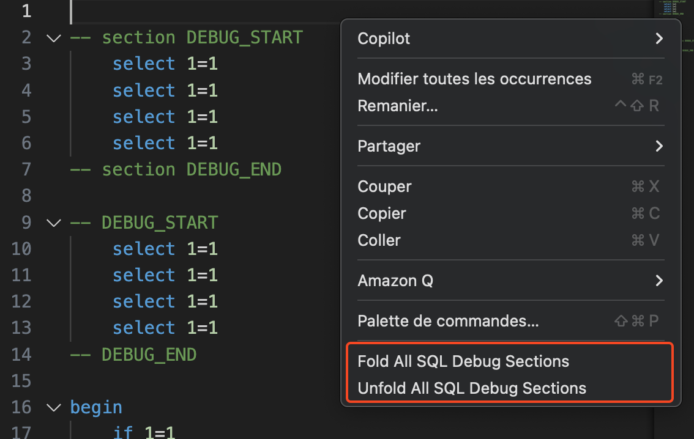
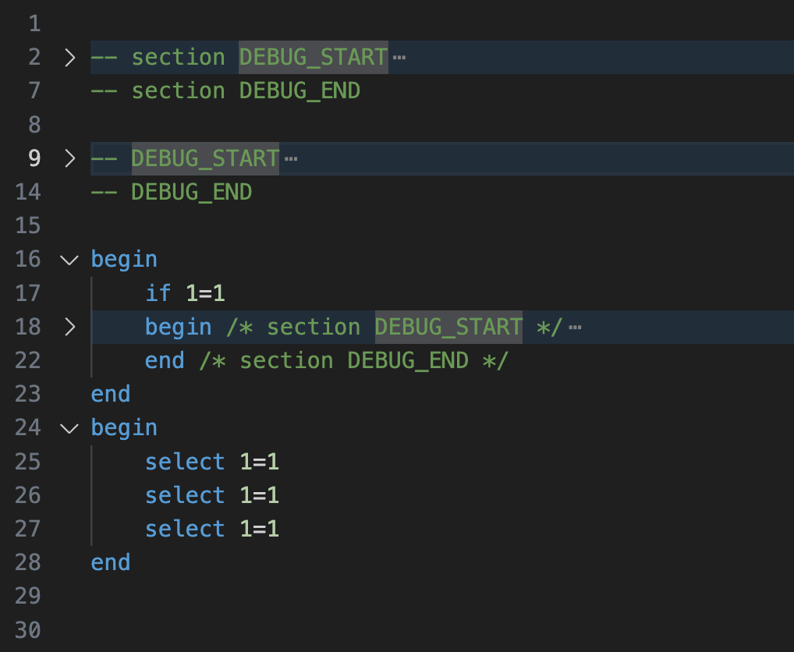

# FoldAllDebug

## Description

**FoldAllDebug** est une extension Visual Studio Code qui permet de plier ou déplier automatiquement les blocs de code de debug identifiés par des marqueurs spécifiques dans les fichiers SQL. Cette extension simplifie la lecture des fichiers SQL complexes en masquant les sections de debug, tout en laissant visibles les parties principales.

---

## Utilisation
Via le menu contextuel du contenu d'un fichier SQL, ou la palette de commande.



Les blocs de debug sont détectés automatiquement selon les marqueurs configurés (voir section Configuration).

### Exemple avant le repliage


### Exemple après le repliage


---

## Exemple de blocs détectés

```sql

begin -- section DEBUG_START
    select 1=1
    select 1=1
end   -- section DEBUG_END


begin /* section DEBUG_START */
    select 1=1
    select 1=1
end   /* section DEBUG_END */

-- section DEBUG_START
    select 1=1
    select 1=1
-- section DEBUG_END

/* section DEBUG_START */
    select 1=1
    select 1=1
/* section DEBUG_END */
```

---

## Fonctionnalités

- Plie ou déplie les blocs de debug entourés par des marqueurs personnalisables (exemples par défaut) :
  - `-- section DEBUG_START` / `-- section DEBUG_END`
  - `/* section DEBUG_START */` / `/* section DEBUG_END`
   - `-- region DEBUG_START` / `-- region DEBUG_END`
  - `/* region DEBUG_START */` / `/* region DEBUG_END`
- Ajoute des commandes accessibles via le menu contextuel (clic droit) dans les fichiers SQL.
- Compatible avec les fichiers SQL uniquement.
- **Aucune dépendance externe requise**.

## Configuration des marqueurs de folding

Vous pouvez personnaliser les marqueurs utilisés pour détecter les régions repliables.

### Méthode recommandée : via l’interface graphique (UI)

1. Ouvrez les **Paramètres** (`Cmd + ,` sur Mac).
2. Recherchez `foldAllSQLDebug.ranges`.
3. Cliquez sur **Modifier en tant que JSON**.
4. Ajoutez votre nouveau format de région à la liste existante (veillez à ne pas supprimer les formats par défaut si vous souhaitez les conserver).

**Exemple :**
```json
[
  { "start": "-- section DEBUG_START", "end": "-- section DEBUG_END" },
  { "start": "/* section DEBUG_START */", "end": "/* section DEBUG_END */" },
  { "start": "-- MON_FOLD_START", "end": "-- MON_FOLD_END" }
]
```

### Méthode avancée : modification directe du `settings.json`

Vous pouvez aussi éditer directement votre `settings.json` utilisateur :

```json
"foldAllSQLDebug.ranges": [
  { "start": "-- section DEBUG_START", "end": "-- section DEBUG_END" },
  { "start": "/* section DEBUG_START */", "end": "/* section DEBUG_END */" },
  { "start": "-- MON_FOLD_START", "end": "-- MON_FOLD_END" }
]
```

⚠️ **Attention** : En modifiant directement la liste dans `settings.json`, vous remplacez entièrement la configuration par défaut. Si vous ne recopiez pas les anciens formats, ils ne seront plus détectés.

---

## Contribution

N’hésitez pas à proposer des améliorations ou à signaler des problèmes via le dépôt